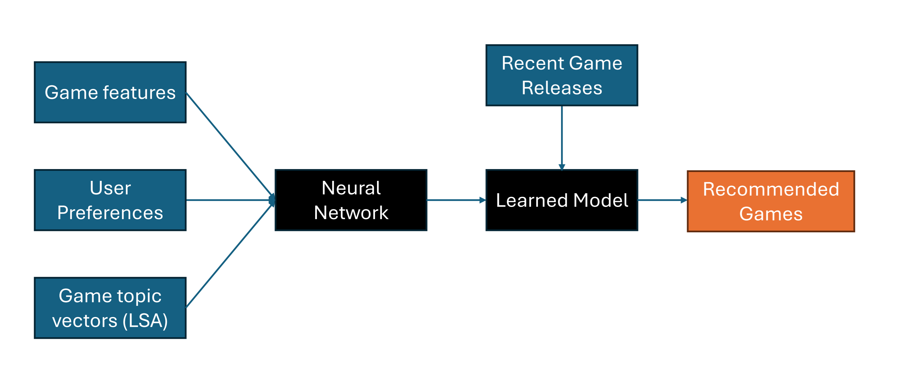

### What does this do?

We build a simple game recommendation engine based on a simple content based approach. 
The user inputs their preferred games, by rating games from 1 to 10. Feature data is then used to predict this score. 
The feature data contains (1) basic attributes about the game and 
(2) simple topic model embeddings which describe the game.
We build a simple neural network to predict the score based on these features and run inference on recent releases. 
Our model validation uses a train/validation/test approach and we measure the performance on validation for this and
then run inference on the test set. 

### Diagram


### Environment set up

```
python -m venv venv
source venv/bin/activate
pip install -r requirements.txt
```

### Running

After setting up the input data (which is not provided in this repo), run :

```
python labels.py
python train.py
```

```
python setup.py bdist_wheel
```

### Results

